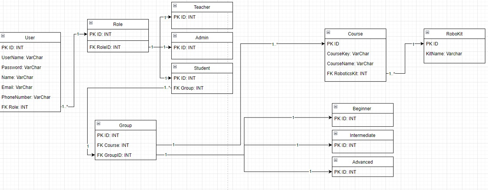

<h1 align="center">
Project Name:
</h1>
<h2 align="center">
Activity 7 Diseño de aplicaciones web
</h2>
<h1 align="center">
Project Description:
</h1>
<h2 align="center">
This project is a laravel program that adds 11 tables to a database for a school. This also includes the files and code necessary to adds the three availible users, and the avaible robotics kits in there respected tables in the database, with the last thing being 100 fake courses added to the course table. 
</h2>
<h1 align="center">
Project ER Diagram:
</h1>
